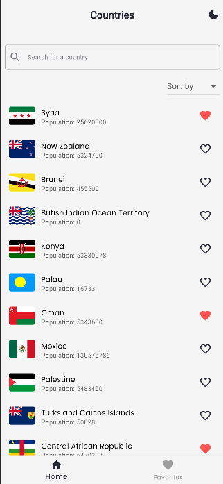
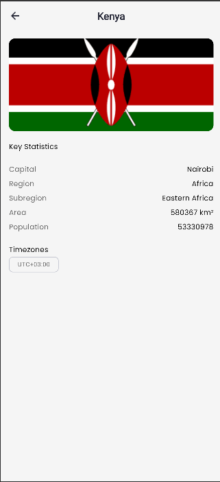
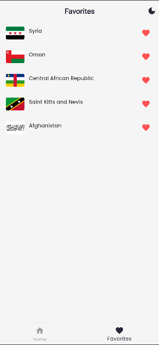
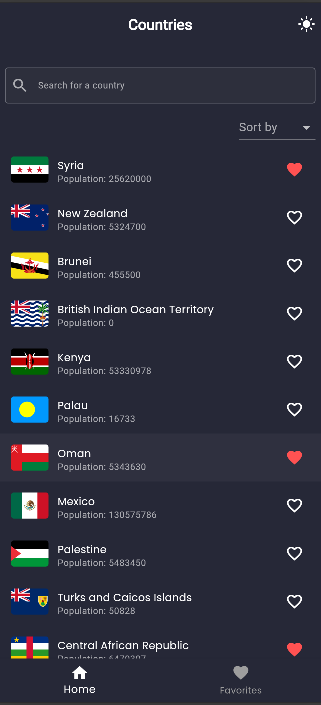

# 🌍 Countries App (Flutter)

A clean, responsive, and production-ready **Flutter application** that allows users to explore, search, and learn about countries around the world.

This project was built as part of the **A2SV Technical Interview Challenge**, showcasing clean architecture, scalable state management (**BLoC**), and attention to detail across mobile, tablet, and web platforms.

---

## 🧭 Table of Contents
- [Overview](#-overview)
- [Features](#-features)
- [Tech Stack](#-tech-stack)
- [Architecture & Decisions](#-architecture--decisions)
- [Setup & Installation](#-setup--installation)
- [Running the App](#-running-the-app)
- [API Reference](#-api-reference)
- [Folder Structure](#-folder-structure)
- [Screenshots](#-screenshots)
- [Deliverables](#-deliverables)
- [Vercel Deployment Setup](#-vercel-deployment-setup)
- [Testing](#-testing)
- [Author](#-author)

---

## 📱 Overview

**Countries App** provides an engaging experience for discovering countries, browsing essential details, and saving favorites.  
It’s fully responsive across **mobile, tablet, and web**, with smooth dark/light mode transitions and offline persistence for favorites.

---

## 🧩 Features

| Feature | Description |
|----------|--------------|
| 🏠 **Home Screen** | Displays all countries (flag, name, population) with shimmer loaders. |
| 🔍 **Search (with Debounce)** | Real-time debounced search by country name to prevent excessive API calls. |
| ↕️ **Sorting** | Sort countries alphabetically or by population, toggle ascending/descending. |
| 📊 **Details Page** | Fetches detailed info dynamically (capital, area, timezone, etc.). |
| 🦋 **Hero Animation** | Smooth flag transition from the list view to the detail page for a polished user experience. |
| ❤️ **Favorites** | Mark/unmark favorites with local persistence (`shared_preferences`). |
| 💡 **Dark Mode** | Automatically adapts between light and dark themes. |
| 📱 **Responsive Design** | Works seamlessly on mobile, tablet, and web. |
| 🔁 **Pull-to-Refresh** | Allows reloading of country data. |
| 💾 **Caching** | Uses simple caching for improved performance and offline viewing. |

---

## 🧠 Architecture & Decisions

| Layer | Responsibility |
|-------|----------------|
| **Data Layer** | Handles API requests and data parsing via Dio. |
| **Logic Layer (BLoC)** | Manages application state, business logic, and side effects. |
| **Presentation Layer** | Displays UI using Flutter widgets and reactive streams. |

### 🧱 Technologies & Libraries
- **State Management** → `flutter_bloc`
- **Networking** → `dio`
- **Local Storage** → `shared_preferences`
- **Code Generation** → `freezed`, `json_serializable`
- **Dependency Injection** → `get_it`
- **Environment Variables** → `flutter_dotenv` for `.env` configuration

---

## ⚙️ Setup & Installation

### 1️⃣ Clone the Repository
```bash
git https://github.com/josephus-mupanda/my-countries-mobile-app.git
cd my-countries-mobile-app
```

### 2️⃣ Install Dependencies

```bash
flutter pub get
```

### 3️⃣ Set Up Environment Variables

This project uses a `.env` file to define the API base URL.

Create a `.env` file in the project root if not present:

```env
API_BASE_URL=https://restcountries.com/v3.1/
```

The `.env` file is already included in the assets section of `pubspec.yaml`:

```yaml
assets:
  - .env

```

### 4️⃣ Generate Model Files

This project uses **Freezed** and **Json Serializable** for model generation.
Run the following command to generate the `.g.dart` and `.freezed.dart` files:

```bash
flutter pub run build_runner build --delete-conflicting-outputs
```

---

## ▶️ Running the App

### 🧩 Android

```bash
flutter run
```

Or build a release APK:

```bash
flutter build apk --release
```

> Output: `build/app/outputs/flutter-apk/app-release.apk`

### 🍎 iOS

```bash
flutter build ios --release
```

> Requires macOS with Xcode installed.

### 💻 Web

```bash
flutter build web --release
flutter run -d chrome
```

Deployed Version:
👉 **[countries-web-app-livid.vercel.app](https://countries-web-app-livid.vercel.app/)**

---

## 🧪 API Reference

| Purpose             | Endpoint                                                                                                           |
| ------------------- | ------------------------------------------------------------------------------------------------------------------ |
| Get All Countries   | `https://restcountries.com/v3.1/all?fields=name,flags,population,cca2`                                             |
| Search by Name      | `https://restcountries.com/v3.1/name/{name}?fields=name,flags,population,cca2`                                     |
| Get Country Details | `https://restcountries.com/v3.1/alpha/{code}?fields=name,flags,population,capital,region,subregion,area,timezones` |

---

## 📂 Folder Structure

```
lib/
 ┣ core/                # App config, constants, routes, themes, utils
 ┣ data/                # Models, repositories, API clients
 ┣ logic/               # BLoCs for countries, favorites, search
 ┣ presentation/        # Screens, widgets, components
 ┗ main.dart            # App entry point
```

---

## 🖼 Screenshots

| Home                                    | Details                                      | Favorites                                         | Dark Mode                               |
| --------------------------------------- | -------------------------------------------- | ------------------------------------------------- | --------------------------------------- |
|  |  |  |  |

---

## 🏁 Deliverables

| Deliverable          | Link                                                                                                     |
| -------------------- | -------------------------------------------------------------------------------------------------------- |
| 📱 GitHub Repository | [https://github.com/josephus-mupanda/my-countries-mobile-app](https://github.com/josephus-mupanda/my-countries-mobile-app)   |
| 🌐 Web Demo          | [https://countries-web-app-livid.vercel.app](https://countries-web-app-livid.vercel.app)                 |
| 📦 APK Download      | [A2SV - Countries Mobile App](https://drive.google.com/file/d/1wv8bs5JzQAKSB5lA8m6nJLhIYJLwnBRV/view?usp=drive_link) |

---

## ▲ Vercel Deployment Setup

To deploy the **web build** on **Vercel**:

### 1️⃣ Build for Web
```bash
flutter build web --release
```

The output will be generated at:
```
build/web/
```

### 2️⃣ Copy the Folder
Copy the entire `build/web` folder contents into another directory (for example, `countries_web_deploy/`).

### 3️⃣ Initialize Git & Push to Vercel
```bash
cd countries_web_deploy
git init
git add .
git commit -m "Deploy Flutter Web to Vercel"
```

Then deploy using:
- **Vercel CLI**, or  
- Push to a **GitHub repo connected to Vercel** (auto-deploys)

That’s it — your Flutter web app will be live instantly on Vercel 🚀

---

## 🧪 Testing

This project includes comprehensive testing with a focus on code quality and reliability. The test suite covers **unit tests** and **widget tests** for all major features.

### 🏗 Test Structure

```
test/
├── helpers/                 # Test utilities and mock data
│   ├── test_helpers.dart
│   ├── mock_data.dart
│   └── helpers_test.dart
├── unit/                    # Unit tests for models and BLoCs
│   ├── models_test.dart     # Tests for CountrySummary, CountryDetails, FavoriteCountry
│   ├── bloc_test.dart       # Tests for CountriesBloc and CountryDetailsBloc
│   └── favorites_bloc_test.dart
├── widget/                  # Widget tests for UI screens
│   ├── home_page_test.dart  # Tests for HomePage with search and favorites
│   ├── detail_page_test.dart # Tests for CountryDetailPage
│   └── splash_page_test.dart # Tests for SplashPage
├── all_tests.dart           # Run all tests together
└── run_tests.bat            # Windows batch script for running tests
```

### 🚀 Running Tests

#### On Windows:

```bash
# Run all tests with coverage
run_tests.bat

# Generate coverage report
generate_coverage.bat

# Run specific test files
flutter test test/unit/models_test.dart
flutter test test/widget/home_page_test.dart
```

#### Run the complete test suite:
```bash
# Using the all_tests runner
flutter test test/all_tests.dart
```

### 📊 Coverage Report

After running tests with coverage (`flutter test --coverage`), you can:
1. **View raw data**: Open `coverage/lcov.info` in a text editor
2. **Generate HTML report**: Install `lcov` and run `genhtml coverage/lcov.info -o coverage/html`
3. **Upload to Codecov**: For continuous integration tracking

### 🧪 Test Types

| Test Type | Purpose | Examples |
|-----------|---------|----------|
| **Unit Tests** | Test individual components in isolation | Models, BLoCs, repositories |
| **Widget Tests** | Test UI components with mocked dependencies | Screens, widgets, search functionality |
| **BLoC Tests** | Test state management logic | Loading, success, error states |

### 🎯 Key Test Scenarios Covered

1. **Country Models**
   - JSON serialization/deserialization
   - Extension methods (commonName, flagUrl, capitalName)
   - Edge cases (empty arrays, missing fields)

2. **BLoC State Management**
   - Loading states during API calls
   - Success states with data
   - Error handling and retry logic
   - Favorites toggling and persistence

3. **Widget UI Tests**
   - Home screen with country list
   - Search functionality with debouncing
   - Favorites screen (empty and populated states)
   - Detail page with hero animations
   - Theme switching (dark/light mode)

## 🏆 Bonus Features Implemented

✅ **Hero Animation** - Smooth flag transitions from list to detail  
✅ **Dark Mode** - Full theme support with persistence  
✅ **Pull-to-Refresh** - Reload data on Home and Favorites screens  
✅ **Search Debouncing** - 400ms delay to prevent excessive API calls  
✅ **Data Caching** - Dio cache interceptor for offline viewing  
✅ **Dependency Injection** - GetIt service locator pattern  
✅ **Code Generation** - Freezed + json_serializable for models  
✅ **Sorting** - Sort by name or population (ascending/descending)  
✅ **Mobile/Tablet/Web Support** - Fully responsive design

---

## 👨‍💻 Author

**Josephus Mupanda**  
📍 Kigali, Rwanda 🇷🇼  
📧 [josephusmupanda48@gmail.com](mailto:josephusmupanda48@gmail.com)  
💼 [GitHub](https://github.com/josephus-mupanda)